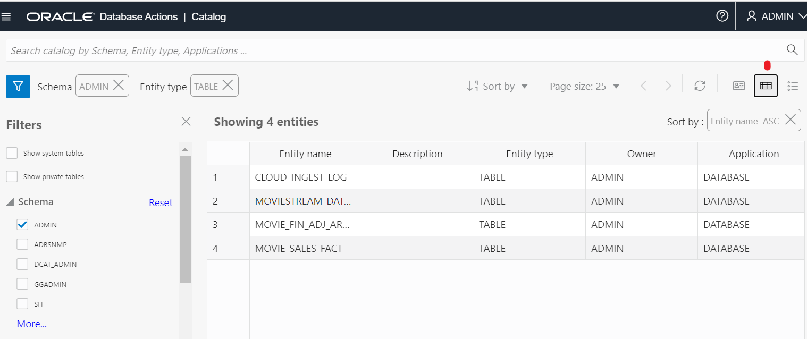

# Use Autonomous Database data catalog.

## Introduction
This lab introduces How to use data catalog in Database Action over Oracle Autonomous Data Warehouse.

Estimated Time: 5 minutes

### Objectives
In this lab, you will:

- Use the Catalog tool

### Prerequisites

To complete this lab, you need to have the following:

- All previous labs successfully completed

## Task 1: Use Autonomous Database Catalog

### MovieStream Critics Corner: Catalog

*True fans of period dramas on MovieStream study [Burke’s Peerage](https://www.burkespeerage.com/) in their spare time. They know that impeccable lineage is a non-negotiable quality in a suitable love-match for an aristocrat. They are just as keenly aware that a clear line of succession is an essential consideration. The untimely demise of a principal character could have profound implications for the continuity of a great family’s line. These people will have an instinctive appreciation for Autonomous Database’s Catalog tool, which shows both Lineage and Impact Analysis clearly for any entity in the system, be it a table, view, business model, or whatever.*

Data is capital and the built-in Catalog tool allows you to maximize its value. Data Lineage and Impact Analysis are now at your fingertips in this integrated tool, which you explore in this part of the workshop.

1. From the **Database Actions** page, select the **Catalog** card. You'll land on a page looking like this. 
  
2. To understand this screen, glance at the upper left to notice that for the current schema, entities of type **TABLE** are currently shown, with a card for each. On the upper right, you'll notice that the third icon from the right (card view) is selected. Click the button to its right to show the information in grid view:
  
3. Click the icon on the far right for list view:
  
4. Personal preference and different use cases may dictate which viewing option is preferable. For the purposes of this section of the workshop, click the **Card View** icon to return to that layout.

### Understand Data Lineage

An important consideration in understanding the reliability of data is its source, or lineage. This capability is built into the Catalog.

5. Click the three dots on the upper right of the card for table **DEVICES**, and select **View Details**. On the left of the panel that appears, you'll see tabs for *Preview, Lineage, Impact, Statistics* and *Data Definition*. Here you'll notice the consistency of the widgets used between the various tools that you've explored in this lab. Preview is the default selection. You've seen Statistics and Data Definition elsewhere in this workshop.
6. For this exercise, click **Lineage**. Various different levels of information are accessible by expanding the various cards as required. To do this, click the three dots to the right of the card and select **Expand***.* Even more information is visible by hovering the mouse pointer over specific areas of the screen. An example is shown below. 
  
7. Click **Close** in the lower right of the screen (or click the **Esc** button on your keyboard) to return to the main catalog view. 

8. Feel free to explore more of its capabilities, or else click **Close** and return to the Autonomous Database Actions Home Page from the hamburger menu at the top left of your screen.

## Want To Learn More

See the documentation on [Database Actions](https://docs.oracle.com/en/database/oracle/sql-developer-web/sdwad/about-sdw.html#GUID-AF7601F9-7713-4ECC-8EC9-FB0296002C69).

## Acknowledgements

- **Author** - Satyabrata Mishra, Product Manager, Platform Technology Services
- **Contributor** - Rajeev Rumale, Product Manager, Platform Technology Services
- **Last Updated By/Date** - Satyabrata Mishra, September 2021
