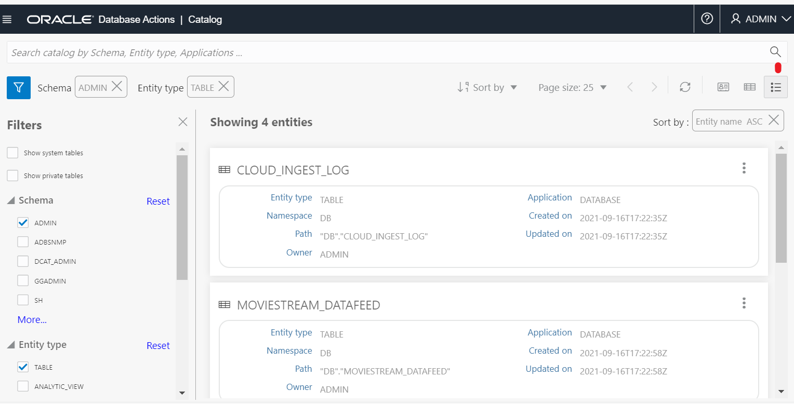
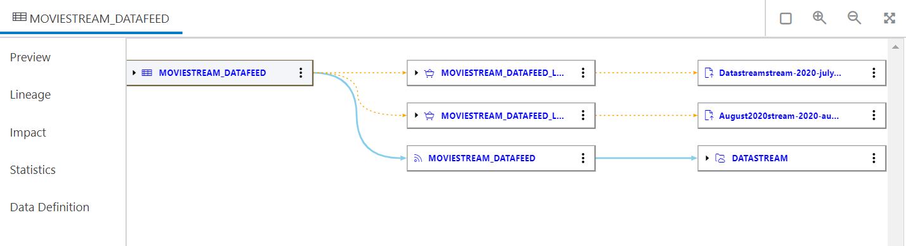

# Use Autonomous Database data catalog.

## Introduction
This lab introduces How to use data catalog in Database Action over Oracle Autonomous Data Warehouse.

Estimated Time: 5 minutes

### Objectives
In this lab, you will:

- Use the Catalog tool

### Prerequisites

To complete this lab, you need to have the following:

- All previous labs successfully completed

## Task 1: Use Autonomous Database Catalog

### MovieStream Critics Corner: Catalog

*True fans of period dramas on MovieStream study [Burke’s Peerage](https://www.burkespeerage.com/) in their spare time. They know that impeccable lineage is a non-negotiable quality in a suitable love-match for an aristocrat. They are just as keenly aware that a clear line of succession is an essential consideration. The untimely demise of a principal character could have profound implications for the continuity of a great family’s line. These people will have an instinctive appreciation for Autonomous Database’s Catalog tool, which shows both Lineage and Impact Analysis clearly for any entity in the system, be it a table, view, business model, or whatever.*

Data is capital and the built-in Catalog tool allows you to maximize its value. Data Lineage and Impact Analysis are now at your fingertips in this integrated tool, which you explore in this part of the workshop.

1. From the **Database Actions** page, select the **Catalog** card. You'll land on a page looking like this. 
  
2. To understand this screen, glance at the upper left to notice that for the current schema, entities of type **TABLE** are currently shown, with a card for each. On the upper right, you'll notice that the third icon from the right (card view) is selected. Click the button to its right to show the information in grid view:
  
3. Click the icon on the far right for list view:
  
4. Personal preference and different use cases may dictate which viewing option is preferable. For the purposes of this section of the workshop, click the **Card View** icon to return to that layout.

### Search The Catalog

5. The catalog has a browser-like search capability. In the search bar across the top, enter **movie sales** and click **Enter**.
6. Only entities matching these criteria will be displayed.
  

### Change the Filter

7. On the upper left of the screen, just above the cards, is the **filter** icon. If it is not highlighted, click it.
8. Under Entity Type, click **More...** and check the boxes for Analytic View and Business Model. Then click **Apply**.
  
9. You now see that the Entity Type list at the top has been expanded correspondingly, and that four cards are displayed. Besides the two tables you saw initially, there are now cards for the Business Model and the Analytic View on which it's based. 
  
10. Clear the search by clicking **x** on the right end of the search bar. Now you see eight cards: six tables, a business model, and an analytic view.
  

### Understand Data Lineage

An important consideration in understanding the reliability of data is its source, or lineage. This capability is built into the Catalog.

11. Click the three dots on the upper right of the card for table **DEVICES**, and select **View Details**. On the left of the panel that appears, you'll see tabs for *Preview, Lineage, Impact, Statistics* and *Data Definition*. Here you'll notice the consistency of the widgets used between the various tools that you've explored in this lab. Preview is the default selection. You've seen Statistics and Data Definition elsewhere in this workshop.
12. For this exercise, click **Lineage**. Various different levels of information are accessible by expanding the various cards as required. To do this, click the three dots to the right of the card and select **Expand***.* Even more information is visible by hovering the mouse pointer over specific areas of the screen. An example is shown below. 
  
13. Click **Close** in the lower right of the screen (or click the **Esc** button on your keyboard) to return to the main catalog view. 

### Impact Analysis

You may think of impact analysis as the inverse of lineage. It shows which other entities are dependent on a specific entity. In this exercise, you'll look at the Impact Analysis for table **MOVIE\_SALES\_2020Q2**.

14. Click the three dots for that card, select **View Details** and then select the **Impact** tab on the left of the screen that appears. You should spend some time exploring the Impact Analysis for this table. Depending on how you drill down (Expand), you may see a screen like this.
  It's worth pausing here to reflect on quite how extensive the impact analysis is for this simple exercise. Here you have a single table, on which you built a business model. This is implemented as an analytic view, including a number of Attribute Dimensions. Against this, you ran an Data Insights job, which resulted in a large number of Insights queries.
15. If you **Expand** on **REQUEST\_INSIGHT_1** (on the right of the screen), you'll see some of the many queries that were executed as part of the Data Insights job, perhaps while you were sipping your coffee! Tip: You can return to a lower-resolution of data by selecting *Collapse* for an entity that had previously been *Expand*ed. 
16. **RECAP** - This concludes the brief guided tour of the **Catalog** tool. In this section, you have seen:

    a. How to view data in card view, grid view, and list view

    b. How to use the browser-like search capability

    c. How to change the filter

    d. How to view Lineage

    e. How to view Impact Analysis

17. Feel free to explore more of its capabilities, or else click **Close** and return to the Autonomous Database Actions Home Page from the hamburger menu at the top left of your screen.

## Want To Learn More

See the documentation on [Database Actions](https://docs.oracle.com/en/database/oracle/sql-developer-web/sdwad/about-sdw.html#GUID-AF7601F9-7713-4ECC-8EC9-FB0296002C69).

## Acknowledgements

- Created By/Date - Patrick Wheeler, Product Management, Autonomous Database, March 2021
- Contributors - Keith Laker, Rick Green, Nilay Panchal, Hermann Baer
- Last Updated By - Arabella Yao, August 2021
