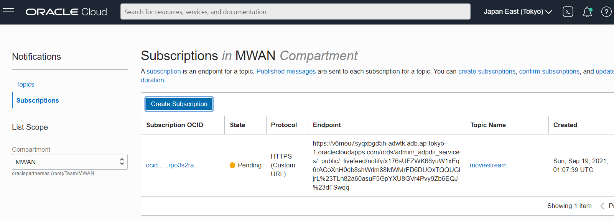

# Feed Data with Real-Time Events from Object Storage to Autonomous Database

## Introduction

This lab takes you through the steps to setup a real-time data feed of new data from the MovieStream data lake on [Oracle Cloud Infrastructure (OCI) Object Storage](https://www.oracle.com/cloud/storage/object-storage.html) into an Oracle Autonomous Database instance.  

You can feed data into your Autonomous Database (Autonomous Data Warehouse [ADW] or Autonomous Transaction Processing [ATP]) using Oracle Database Actions Feed Data.  Feed Data can be done with either a scheduled job or with real-time event notification.  For this lab, we will use real-time event notification and feed customer movie stream data.  The movie stream contains movies customers are watching, when, and whether the customer paid a premium.

Estimated Time: 15 minutes

### About Product

In this lab, we will learn more about the Autonomous Database's built-in Database Actions Data Feed tool - see the [documentation](https://docs.oracle.com/en/database/oracle/sql-developer-web/sdwad/adp-ld-feeding-data.html) for more information.

### Objectives

- Learn how to setup Oracle Database Actions Real-Time Data Feed from Object Storage to your Autonomous Database
- Learn to emit notifications from the Object Storage bucket
- Learn about OCI notifications and service subscription

### Prerequisites

- This lab requires you to have access to an Autonomous Database instance (either ADW or ATP).

- This lab requires you to have access to the Object Storage bucket to enable emit notifications and to upload a stream of customer movie data to the bucket

- This lab requires completion of Lab 1, **Provisioning an Autonomous Database**, in the Contents menu on the left.


## Task 1: Create Object Storage Bucket and Emit Events

In this step you will create an Object Storage bucket and configure it to emit object events.  You will also set the bucket to public for simplicity in this lab.

1. Open the Cloud Console navigation menu and click **Storage**. Under **Object Storage and Archive Storage**, click **Buckets**.

2. **If you're creating a new bucket:**

   1. On the Buckets page, click the **Create Bucket** button to create a new bucket, as described in [Managing Buckets](https://docs.oracle.com/en-us/iaas/Content/Object/Tasks/managingbuckets.htm). In the **Create Bucket** wizard, select the **Emit Object Events** option, along with the other options for your new bucket.

      

   2. Click Create.


   **If you're using an existing bucket:**

   1. On the Buckets page, click the name of the bucket you want to use, as described in [Managing Buckets](https://docs.oracle.com/en-us/iaas/Content/Object/Tasks/managingbuckets.htm).
   2. On the Bucket Details page, click the **Edit** link next to **Emit Object Events**.
   3. Select the **Emit Objects Events** check box, and then click **Save Changes**.

3. Note we set your bucket to Public to simplify the access.  From your bucket 3-dot menu, select Edit Visibility and change to Public.

   

4. Click Save Changes.

5. Note down the URI path of the bucket.  We will use this in a later task.  You can retrieve the URI by uploading an object and then clicking on the 3-dot object detail.  The URI is the part minus the object name.   For example, the URI path for the bucket below is http://objectstorage.ap-tokyo-1.oraclecloud.com/n/oraclepartnersas/b/moviestream/o

   


## Task 2: Create a Notifications service subscription topic

We will now create an OCI Notifications service with a subscription topic for the movie stream event.  We are essentially creating a URI to the bucket event.  The [Notifications service](https://docs.cloud.oracle.com/iaas/Content/Notification/Concepts/notificationoverview.htm) helps you broadcast messages to distributed components through a publish-subscribe pattern. Use Notifications to get notified when event rules are triggered or alarms are breached, or to directly publish a message.

1. Open the Cloud Console navigation menu and click **Developer Services**. Under **Application Integration**, click **Notifications**.
2. Click **Create Topic**, enter a name and optional description, and then click **Create**.

   

## Task 3: Create an Events Service Rule

We will now create a rule to capture events from the Object Storage with event type of objects being created in the bucket.  This means when the movie stream data is placed in the bucket, create the event.

1. Open the Cloud Console navigation menu and click **Observability & Management**. Under **Events Service**, click **Rules**.
2. Click Create Rule, and fill out the Create Rule page.

Under Rule Conditions select:

- **Condition:** Event Type

- **Service Name:** Object Storage

- **Event Type:** Object - Create


Under Actions select:

- **Action Type:** Notifications

- **Notifications Compartment:** Select the compartment to use for the notifications.

- **Topic:** Select the name of the topic you created above, in [Step 2: Create a Notifications service subscription topic](https://docs.oracle.com/en/database/oracle/sql-developer-web/sdwad/feed.html#GUID-9C904C07-23EB-470A-BE3A-F3A57B4E1E28__CREATE_TOPIC).


3. Click **Create Rule**.

## Task 4: Configure the Database Actions Data Feed

In this step you will set up a real-time data feed of customer movie stream data from a bucket on Oracle Object Storage.

1. In your ADW database's details page, click the Tools tab. Click **Open Database Actions**

	  

2. On the login screen, enter the username ADMIN, then click the blue **Next** button.

3. Enter the password for the ADMIN user you set up in the previous lab when provisioning ADW.

4. Under **Data Tools**, click **DATA LOAD**

    

5. In the **What do you want to do with your data?** section, click both **FEED DATA** and **CLOUD STORAGE** and then NEXT.  

    

6. To set up the connection from your Autonomous Database to OCI Object Storage, click **Manage Cloud Store**.  To add access to the new landing area for the movie stream data, click **+Add Cloud Storage** in the top right of your screen.

    In the **Name** field, enter 'moviestream'

    Leave the Cloud Store selected as **Oracle**.

    Copy and paste the URI of your bucket that will hold the movie stream data into the URI + Bucket field. This was done in Task1, Step 5 above.

    ```

    ******* need URI where the movie stream data .csv file will be loaded
    ******* below is an example
    https://objectstorage.us-ashburn-1.oraclecloud.com/n/c4u04/b/movie/o

    ```

    Select **No Credential** as this is a public bucket.

    Click the **Test** button to test the connection. Then click **Create**.

    

7. Now that we have added a connection to the OCI Object Storage go back to the main Data Load page and click **Feed Data** from **Cloud Storage**.

    

8. Click **Create Live Table Feed**.

- You can leave the defaults for **Live Table Feed Name** and **Target Table Name** field, or you can enter your own unique names.

    > **Note:** Take care not to use spaces in the name.

    

- Enter *.csv for the **Object Filter** field

- Select the Cloud Storage or bucket that will contain the new movie stream data.

- Scroll down and click **Enable for Notification**.

- Uncheck **Enable for Scheduling**.

    

    9. Click Create.  Your live data feed is now set up.

    10. From your Live_Table_Feed card, click on the 3 dot menu and select Show Confirmation URL

    


    11. In the **Notification URL** dialog box, click the **Copy** icon to copy the URL to the clipboard. You may want to copy it to a temporary file, so you can retrieve it later. You'll use this URL in the next step.


    


## Task 5: Create a Notifications service subscription

We will now create an OCI Notification subscription from the Live Data Feed URL we copied earlier.

1. Return to the Oracle Cloud Infrastructure Console. Open the navigation menu and click **Developer Services**. Under **Application Integration**, click **Notifications**.

2. On the Notifications page, click the **Subscriptions** tab (on the left side of the page).

   

3. Click **Create Subscription** and fill in the Create Subscription page:

   **Subscription topic:** Select the subscription topic you created in Task 2.

   **Protocol:** HTTPS (Custom URL)

   **URL:** Paste in the URL you copied earlier from the Live-data-feed card.

   Click **Create**. The subscription will be listed in the **Subscriptions** table in a state of "Pending."

   

## Task 6: Confirm that the endpoint can receive notifications

From the Database Actions: Live Feeds page

1. Return to the Database Actions Live Feeds page and find the card for the live table feed you are configuring for a notification-based feed.

2. Click the Actions (three vertical dots) icon on the card, and select **Show Confirmation URL**.

3. In the **Confirmation URL** dialog box, **click** the link to confirm the URL. This does not close this dialog box. If the link is successful, a message is displayed that confirms the subscription is active.

   

   

4. Return to the Confirmation URL dialog box and select the **Check only when the cloud store confirmation process is complete check box**, and click OK.

   

   If you now return to the OCI Notifications Subscriptions page you will see it is active.

   

Once you finish the above steps, any new files uploaded to the bucket will automatically be loaded into the live table feed table.

## Task 7:  Upload the Real-Time Movie Stream Data to the Object Storage Bucket

Normally a process would stream data into the Object Storage.  But we will upload an object containing the movie stream data.

1. From your Object Storage bucket, upload the file stream-2020-Aug.csv.

   

## Task 8: View the Real-Time Movie Stream Data

In this step, we will check whether the new movie stream data that has been fed automatically into ADW using the OCI event and notifications system.  

1. From Database Actions, select the Live Table Feed card for notifications and click on the 3-dot menu and select **Live Table Feed Run Details**.

    

    You should see the below status which indicates that the object has been fed into ADW.  If you don't wait a few seconds and select Live Table Feed Run Details again.

    

2. We will also check the database table with SQL.  From the Database Actions hamburger menu on the top left, click the SQL link in the top left of your screen under Development.

    

3. Now enter the following SQL statement in the SQL Worksheet and click the run icon.  

    select * from MOVIESTREAM

    


You should now see the new movie stream data containing what movies the customers are watching, at what time, and the price premium if any.

This lab showed how to setup a real-time data feed of new data from the MovieStream data lake on [Oracle Cloud Infrastructure (OCI) Object Storage](https://www.oracle.com/cloud/storage/object-storage.html) into an Oracle Autonomous Database instance.  

The lab used the OCI Notification and Subscription service to subscribe to events in the Object Storage bucket and data was then fed "pushed" to ADW.

## Acknowledgements

* **Author** - Milton Wan, Database Product Management
* **Contributors** -  Vijay Balebail, Database Product Management
* **Last Updated By/Date** - Milton Wan, Database Product Management, September 2021
