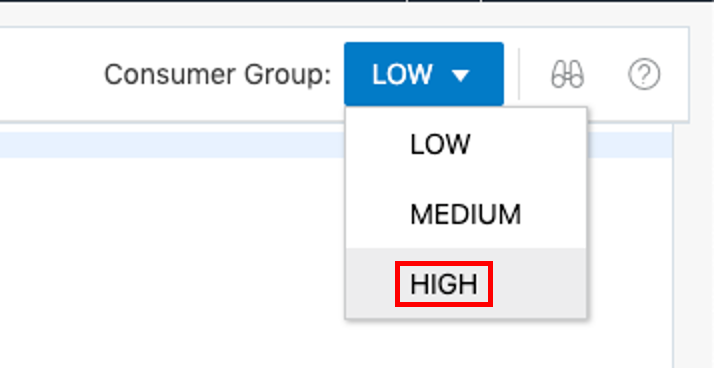
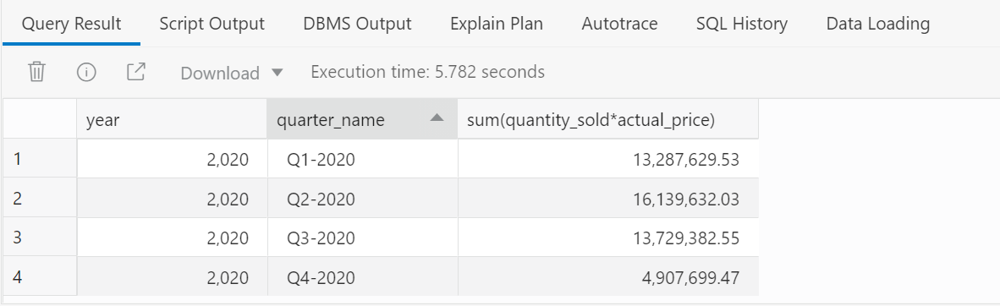

# Analyzing Movie Sales Data

## Introduction

In most real-world scenarios, queries against your data warehouse would normally involve the use of a data visualization tool such as Oracle Analytics Cloud (alternatively, 3rd party business intelligence products such as Qlik, Tableau, PowerBI, and so on, currently support Autonomous Data Warehouse). Within this part of the workshop we will use SQL commands to query our data using the built-in SQL Worksheet.  


Estimated time: 5 minutes

### Objectives

- Understand how to use SQL Worksheet

- Learn about the different types of built-in calculations


### Prerequisites

- You will need to have complete previous Labs workshop like ADW creation and loading movie sales data from object store to ADW. The **Getting Started** section of that prerequisite workshop describes how to obtain an Oracle cloud account if you do not already have one. In that workshop you provision an Oracle Autonomous Database, and then load the MovieStream data needed for this analytics workshop.

Before starting to run the code in this workshop, we need to manage the resources we are going to use to query our sales data. You will notice that when you open SQL Worksheet, it automatically defaults to using the LOW consumer group - this is shown in the top right section of your worksheet.


**NOTE**: Autonomous Data Warehouse comes complete with three built-in consumer groups for managing workloads. The three groups are: HIGH, MEDIUM and LOW. Each consumer group is based on predefined CPU/IO shares based on the number of OCPUs assigned to the ADW. The basic characteristics of these consumer groups are:

* HIGH: A high priority connection service for reporting and batch workloads. Workloads run in parallel and are subject to queuing.
* MEDIUM: A typical connection service for reporting and batch workloads. Workloads also run in parallel and are subject to queuing. Using this service the degree of parallelism is limited to 4.
* LOW: A connection service for all other reporting or batch processing workloads. This connection service does not run with parallelism.

For more information about how to use consumer groups to manage concurrency and prioritization of user requests in Autonomous Data Warehouse, please click the following link: [Manage Concurrency and Priorities on Autonomous Database](https://docs.oracle.com/en/cloud/paas/autonomous-database/adbsa/manage-priorities.html#GUID-19175472-D200-445F-897A-F39801B0E953). If you want to explore this topic using a workshop, [click here](https://apexapps.oracle.com/pls/apex/dbpm/r/livelabs/view-workshop?wid=618) to launch the **Managing and Monitoring in Autonomous Database** workshop.

Change the consumer group by simply clicking the downward pointing arrow next to the word LOW, and from the pulldown menu select **HIGH**.

    


## Task 1: Exploring Sales Data

1. To get started, let's use a very simple query to look at total movie sales by year and quarter, which extends the earlier simple SQL queries by adding a GROUP BY clause.

    **Note**: For copy/pasting, be sure to click the convenient Copy button in the upper right corner of the following code snippet, and all subsequent code snippets:

    ```
    <copy>SELECT
     year,
     quarter_name,
     SUM(quantity_sold * actual_price)
    FROM movie_sales_fact
    WHERE YEAR = 2020
    GROUP BY year, quarter_name
    ORDER BY 1,2;</copy>
    ```
    **Note**: In this query, we have returned a resultset where the data has been aggregated (or grouped by) year then, within year, by quarter. The ORDER BY clause sorts the resultset by year and then quarter. In addition there is a filter or WHERE clause that allows us to return only data for the year 2020.

2. The result should look something like this:

    

3. Lets run below simple query and keep the output for future reference.

    ```
    <copy>SELECT
    SUM(actual_price)
    FROM movie_sales_fact;</copy>
    ```

Please *proceed to the next lab*.

## **Acknowledgements**

- **Author** - Keith Laker, ADB Product Management
- **Adapted for Cloud by** - Richard Green, Principal Developer, Database User Assistance
- **Last Updated By/Date** - Keith Laker, July 2021
